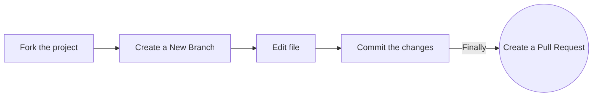

<div id="top"></div>
<h1 align="center">GDSC TECB MACHINE LEARNING PROJECTS </h1>


 <!-- ---------------------------------------------------------------------------------------------------------------------- -->

<!-- ---------------------------------------------------------------------------------------------------------------------- -->


<!-- ------------------------------------------------------------------------------------------------------------------------------------------------------ -->
<!-- ------------------------------------------------------------------------------------------------------------------------------------------------------------- -->
<div id="About"></div>

# About
Getting started with ML? What else would be better than Implementing it.
So welcome ML Enthusiast. You are at the right place.😊
GDSC TECB provide some awesome ML related projects to work upon and enhance your skills.
The motive🎯 of this project is to help new learners like you to get familiar with Machine Learning.
Happy coding.👍

**So, What are you waiting for?**
<br>

<!-- ------------------------------------------------------------------------------------------------------------------------------------------------------ -->
<!-- ------------------------------------------------------------------------------------------------------------------------------------------------------------- -->

<div id="Open-Source-Program"></div>

# This Project is a part of Hacktober Fest 2k23 Open Source Program

<br>

<table>
<tbody><tr>
<td align="center"><a href="https://hacktoberfest.digitalocean.com/"  target="_blank"><br><sub><b> Hacktoberfest 2023 </b></sub></a></td> </a></td>


</tr>
</tbody></table>

<br>


<!-- ------------------------------------------------------------------------------------------------------------------------------------------------------ -->
<!-- ------------------------------------------------------------------------------------------------------------------------------------------------------------- -->
<div id="Before"></div>

# General information Before you begin💻

We would request you to go through the contributing guidelines throughly so that you know what you are doing.

Little knowledge of Github would be benificial for you so that you know what you are doing.

**Don't keep files in a haphazard manner , Always follow a proper file structure . Follow proper naming pattern while pushing new files (eg: if a project name is ```Sentiment analysis``` then the code file name should be ```code.py``` similar for all files.) Don't mix the files or make new folders.**


# Contributing Guidelines📝

Only contribute to the existing projects for any feature that can be added for making it more optimised by first raising an issue.

These are some instructions on how to create a pull request

### Option 1. Complete this process in GitHub (in your browser)



**1. Fork the project:**

- Click the gray <kbd>Fork</kbd> button at the top right of this page. This creates your copy of the project and saves it as a new repository in your GitHub account.

**2. Create a New Branch:**

- On your new repository's page, click the gray main button in the upper left to reveal a dropdown menu.
- Enter the name of your new branch in the text box. (Branch names usually refer to what is being changed. Example: nameAdd).
  -Click on Create branch <new branch name>, which will automatically take you to your new branch. You can make edits on the main branch, but this may cause issues down the line. The best practice is to create a new branch for each separate issue you work on. That way your main branch remains in sync with Eddie's main branch.

**3. Edit:**

-If you find that new features or some modifications can be done in the given project then you can add that part of the code in your forked repo and then raise a issue.

**4. Raise a Pull Request:**

- Click `Pull Requests` option in your forked repository (which is the third option at the top of this page after the options `Code` and `Issues`).
- Click the green New Pull Request button. This will prep the new pull request for you by auto-filling the base repository: base with 'Google-Developer-Student-Clubs-TECB main' AND auto-filling your head repository: compare with your repository: main
- Click on your head repository's `compare` dropdown, and switch branches from your 'main' branch to `<new branch name>`.
- Finally, click the green `Create Pull Request` button. Great job! You did it!

You can ask questions by raising an [issue](https://github.com/Google-Developer-Student-Clubs-TECB/Machine-Learning-Projects/issues/new).

### Option 2. Complete this process on your computer (locally)

**1. Fork the project:**

- Click the gray Fork button at the top right of this page. This creates your copy of the project and saves it as a new repository in your GitHub account. 

**2. Clone this project on your computer:**

- Go to your profile. You will find forked repo named **_open-source-practice_**. go to the repo by clicking on it.
- Click on the green Code button, then either the HTTPS or SSH option, and, click the icon to copy the URL. Now you have a copy of the project. Thus, you can play around with it locally on your computer.

- Run the following commands into a terminal window (Command Prompt, Powershell, Terminal, Bash, ZSH). Do this to download the forked copy of this repository to your computer. 

```bash
  git clone https://github.com/YOUR_GITHUB_USERNAME/Machine-Learning-Projects.git
```

```bash
  cd Machine-Learning-Projects
```

**3. Create a new branch:**

- Your username would make a good branch because it's unique. 

```bash
  git checkout -b <name-of-new-branch>
```

**4. Edit:**

--If you find that new features or some modifications can be done in the given project then you can add that part of the code in your forked repo and then raise a issue.


**5. Stage your changes:**


```bash
  git add .
```

**6. Commit the changes:**

```bash
  git commit -m "Some Useful Message"
```

- Check the status of your repository.

```bash
  git status
```

```bash
On branch <name-of-your-branch>
nothing to commit, working tree clean
```

**7. Pushing your repository to GitHub:**

```bash
  git push origin <name-of-your-branch>
```

or

> **Warning**: If you get an error message like the one below, you probably forgot to fork the repository before cloning it. It is best to start over and fork the project repository first.

```bash
ERROR: Permission to Google-Developer-Student-Clubs-TECB/Machine-Learning-Projects.git denied to <your-github-username>.
fatal: Could not read from remote repository.
Please make sure you have the correct access rights and that the repository exists.
```

**8. Raise a Pull Request:**

- On the GitHub website, navigate to your forked repo - on the top of the files section, you'll notice a new section containing a `Compare & Pull Request` button! 

- Click on that button, this will load a new page, comparing the local branch in your forked repository against the main branch in the EddieHub Hacktoberfest repository. Do not make any changes in the selected values of the branches (do so only if needed), and click the green `Create Pull Request` button. After creating the PR (Pull Request), our GitHub Actions workflow will add a welcome message to your PR.
  Note: A pull request allows us to merge your changes with the original project repo.

- Your pull request will be reviewed and then eventually merged.

Hurray! You successfully made your first contribution! 🎉

## Our Pledge

We take participation in our community as a harassment-free experience for everyone and we pledge to act in ways to contribute to an open, welcoming, diverse and inclusive community.


